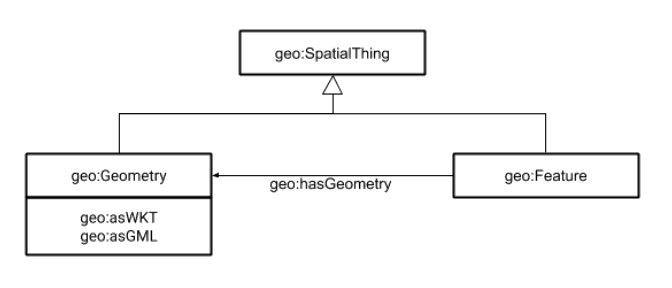

# Decálogo para la publicación de datos geográficos en RDF

*Autores: David Portolés Rodríguez, F. J. López Pellicer, Óscar Corcho*.

Este documento describe algunas pautas y recomendaciones para realizar la publicación de un conjunto de datos geográficos en formato RDF.

Las diez pautas y recomendaciones descritas en este documento reflejan los aspectos más relevantes a considerar para lograr esta publicación, si bien es recomendable consultar otros documentos de referencia como [Spatial Data on the Web Best Practices (SPW-BP)](https://www.w3.org/TR/sdw-bp/) o el artículo [Geographical Linked Data: a Spanish Use Case](http://oa.upm.es/6167/1/Geographical_Linked_Data_A_Spanish_Use_Case.pdf).

Como requisito previo para la aplicación de las recomendaciones propuestas en este documento, se recomienda disponer de un geodato válido, de calidad, revisado y conforme a un modelo de datos documentado. También es necesario tener conocimientos básicos de RDF.

## 1. Utiliza una URI para nombrar las cosas a las que te quieres referir

Los datos enlazados se basan en la utilización de URIs para generar referencias para cualquier objeto con entidad suficiente. Una URI no es más que un **identificador**. Es uno de los [principios de los Datos Enlazados](https://es.wikipedia.org/wiki/Datos_enlazados).

Además, esta URI es una dirección Web. Por ejemplo, en la [Ontología para la representación de los datos de la Base Topográfica Nacional BTN100](https://datos.ign.es/def/btn100/index-es.html) (BTN100 en adelante), se identifica la provincia de Alicante con [https://datos.ign.es/recurso/btn100/provincia/alacant-alicante](https://datos.ign.es/recurso/btn100/provincia/alacant-alicante).

## 2. Los conceptos base: Spatial Thing, Feature, Geometry

En el ámbito SIG e IDE se han utilizado a veces los términos "fenómeno", “*feature”* e incluso “geometría” indistintamente. En el ámbito de la semántica, se otorga mucha importancia a la precisión en la definición de los conceptos por lo que no son intercambiables. Lo habitual para representar los elementos geográficos es distinguir tres conceptos: 
* *Spatial Thing*: el objeto real y sus abstracciones.
* *Feature*: una de sus múltiples abstracciones.
* *Geometry*: una de sus representaciones geométricas.

Puede consultarse más información al respecto en [Spatial Things, Features and Geometry (SPW-BP)](https://www.w3.org/TR/sdw-bp/#spatial-things-features-and-geometry).

Se recomienda utilizar los tres conceptos anteriores conforme a su definición en la ontología [OGC GeoSPARQL 1.0](http://schemas.opengis.net/geosparql/1.0/geosparql_vocab_all.rdf). Para mayor claridad, a continuación se muestra un diagrama que servirá como referencia también para los siguientes apartados donde está la relación entre los conceptos *Spatial Thing*, *Feature* y *Geometry* en GeoSPARQL.

  

En el diagrama anterior puede comprobarse que se divide en la parte **geométrica en geo:Geometry** (a la cual se refieren los apartados 3 a 6) y los **atributos alfanuméricos en geo:Feature** asociados a la misma (apartado 7).

*Nótese que en este documento se va a utilizar el prefijo **geo:** para la ontología OGC GeoSPARQL 1.0 y que corresponde con [http://www.opengis.net/ont/geosparql#](http://www.opengis.net/ont/geosparql#). No debe confundirse con [http://www.w3.org/2003/01/geo/wgs84_pos#](http://www.w3.org/2003/01/geo/wgs84_pos#) el cual en ocasiones también es referido como geo:.*

## 3. Referencia tu geometría con geo:*hasGeometry* siguiendo un esquema de URI

Para cada *geo:Feature* hay que crear al menos un objeto *geo:Geometry* identificado por una URI y relacionado con la *geo:Feature* mediante la propiedad *geo:hasGeometry*. Esto permitirá que un objeto pueda tener asociadas distintas geometrías (por ejemplo, dependiendo de la escala que se quiera utilizar o el grado de detalle de la misma).

Se recomienda que la URI de la *geo:Geometry* y la URI del *geo:Feature* al que hace referencia sigan un esquema de URI relacionado de tal forma que se pueda navegar de una hacia la otra de forma sencilla (por ejemplo, si hay solo una única geometría añadiendo **/geometry** al final de la URI, o añadiendo **/geo** como penúltimo elemento de la URI, etc.). En algunos casos se usa la propiedad inversa *isGeometryOf* pero no está definida formalmente.

Por ejemplo, en el caso de BTN100 se utiliza la convención de añadir **/geometry** al final de la URI que identifica a la *geo:Feature*:

<table>
  <tr>
    <td>Provincia de Alicante</td>
    <td><a title="Provincia de Alicante" href="https://datos.ign.es/recurso/btn100/provincia/alacant-alicante">https://datos.ign.es/recurso/btn100/provincia/alacant-alicante</a></td>
  </tr>
  <tr>
    <td>Geometría de la provincia de Alicante</td>
    <td><a title="Geometría de la provincia de Alicante" href="https://datos.ign.es/recurso/btn100/provincia/alacant-alicante/geometry">https://datos.ign.es/recurso/btn100/provincia/alacant-alicante<b>/geometry</b></a></td>
  </tr>
</table>

Si hubiera múltiples geometrías, se pueden crear URIs que enumeren dichas geometrías (por ejemplo añadiendo /geometry-1, /geometry-2, etc.)

## 4. Identifica el SRS mediante una URI

Se recomienda utilizar URIs para representar el sistema de representación espacial (SRS) de las coordenadas. Del mismo modo a como es habitual en el mundo SIG, se utilizan los códigos EPSG para identificarlos. La URI para identificar el EPSG:25830 sería [http://www.opengis.net/def/crs/EPSG/0/25830](http://www.opengis.net/def/crs/EPSG/0/25830), y si se accede a dicha URI se obtienen los detalles de ese SRS.

También es posible utilizar el EPSG por defecto, que es el que corresponde a WGS84 con longitud-latitud (ojo, difiere de EPSG:4326 que invierte el orden a latitud-longitud). No obstante, hay que tener en cuenta que[ hay una propuesta de OGC para modificar estas URIs](https://www.ogc.org/blog/3260).

## 5. Caracteriza tu geometría

Los tipos de geometría recomendados se seleccionan según la ontología *[OGC Simple Features](http://schemas.opengis.net/sf/1.0/simple_features_geometries.rdf)*, siendo lo más habitual uno de los siguientes: *[Polygon](http://www.opengis.net/ont/sf#Polygon)*, *[Point](http://www.opengis.net/ont/sf#Point)*, etc., todos ellos especializaciones de *Geometry*.

Se recomienda que la descripción de la geometría de un objeto *Geometry* se haga mediante las propiedades *geo:asWKT* o *geo:asGML* almacenando la representación geometría en el formato alfanumérico [WKT](https://es.wikipedia.org/wiki/Well_Known_Text) o [GML](https://es.wikipedia.org/wiki/Geography_Markup_Language), respectivamente. Ambos formatos están soportados por la mayoría de las bases de datos espaciales.

Por ejemplo, la [geometría de la provincia de Alicante en BTN100 ](https://datos.ign.es/recurso/btn100/provincia/alacant-alicante/geometry)informa de lo siguiente:

<table>
  <tr>
    <td>geo:asWKT</td>
    <td>MULTIPOLYGON(((-0.75350276963707 37.871624206989, -0.75354660978815 37.872005917037, -0.75330279998417 37.87212333702, -0.75350276963707 37.871624206989)), ((-0.47403678007328 ... </td>
  </tr>
  <tr>
    <td>rdf:type</td>
    <td>&lt;http://www.opengis.net/ont/sf#MultiPolygon&gt;</td>
  </tr>
</table>

Si se quiere indicar un SRS diferente al de por defecto, entonces hay que indicarlo de diferente forma, según el formato elegido:

<table>
  <tr>
    <td>WKT</td>
    <td><b>&lt;http://www.opengis.net/def/crs/EPSG/0/4326&gt;</b>POINT(33.95 -83.38)</td>
  </tr>
  <tr>
    <td>GML</td>
    <td>&lt;gml:Point srsName="<b>http://www.opengis.net/def/crs/EPSG/0/4326</b>" xmlns:gml="http://www.opengis.net/ont/gml"&gt; 
(…) 
&lt;/gml:Point&gt;</td>
  </tr>
</table>

## 6. Reaprovecha geometrías ya publicadas

No siempre hay que definir explícitamente la geometría para tener un geodato en RDF. Así por ejemplo se puede referenciar la URI de objetos que ya estén publicados y que contengan dicha geometría. De este modo, únicamente se publicaría la información específica y se referenciaría la URI que aporta la geometría.

Este puede ser el caso, por ejemplo, de una geometría que tenga dos posibles dominios de aplicación: una parcela para Catastro (cuya finalidad es la de realizar la gestión tributaria) puede ser reutilizada para la gestión cinegética por otro organismo diferente.

La forma de reutilizar, por ejemplo. la geometría de un municipio o de una carretera publicada en datos.ign.es, se realizará referenciando en *geo:hasGeometry* la URI publicada en datos.ign.es de la geometría.

También, para información ráster especialmente, es recomendable reutilizar los códigos de cuadrículas a diferentes escalas que se hayan publicado. Así por ejemplo se dispone de las cuadrículas europeas conforme a Lambert (ya publicadas en [https://crossnature.eu/](https://crossnature.eu/)) o específicas de la Península Ibérica conforme a ETRS89 Huso 30 extendido a 10km, 1km y 25m de tamaño (prevista su publicación en [https://crossforest.](https://crossforest.eu)[eu](https://crossforest.eu))

Otra alternativa que se puede utilizar es la de usar URI que apuntan a servicios de descarga directa que están ofreciendo estas geometrías, como por ejemplo, una petición a un WFS. De este modo no es necesario replicar la geometría en RDF, reduciendo el tamaño del mismo considerablemente. Otra ventaja es la posibilidad de negociar el formato de representación de la geometría proporcionada por el servicio. La principal desventaja es que no será posible utilizar consultas espaciales GeoSPARQL a la hora de consultar datos en RDF en un sistema que sea capaz de procesar GeoSPARQL.

## 7. Representa los atributos alfanuméricos del SpatialThing conforme a un modelo y reutiliza siempre que puedas

Los atributos alfanuméricos asociados a los objetos se incluirán en otras propiedades del concepto en RDF a generar.

La generación de estas propiedades seguirán todas las buenas prácticas y recomendaciones existentes y estandarizadas en el ámbito Linked Data general (no espacial). Especialmente todo lo relacionado con tipos de datos, vocabularios, etc. 

Las propiedades generadas deberán estar en concordancia con un modelo documentado y publicado con ejemplos para poder validar que se cumple, el cual reutilice siempre que sea posible todos aquellos vocabularios o propiedades que ya se hayan definido previamente en otras iniciativas. El grado de formalidad de dicha documentación dependerá de las necesidades del proyecto (desde páginas de texto a ontologías formales).

Entre las propiedades a generar se recomienda que se incluyan como mínimo:

* Un tipo específico (*rdf:type*)

* Una propiedad descriptiva que permita denominar al elemento (*dcterms:title* o similar)

* Propiedades específicas del dominio

Así por ejemplo para el [municipio de Las Rozas de Madrid](https://datos.ign.es/recurso/btn100/nucleo-poblacion-superficial/2500), se ofrece de esta información alfanumérica en BTN100 (nótese que se definen propiedades *ad hoc* y se reaprovechan de otras iniciativas):

<table>
  <tr>
    <td>rdf:type</td>
    <td>btn100:NucleoPoblacionSuperficial</td>
  </tr>
  <tr>
    <td>dcterms:title</td>
    <td>Las Rozas de Madrid</td>
  </tr>
  <tr>
    <td>esadm:codigoINE</td>
    <td>28127000401</td>
  </tr>
  <tr>
    <td>geonames:population</td>
    <td>42805</td>
  </tr>
  <tr>
    <td>btn100:tipoDeCapital</td>
    <td>https://datos.ign.es/kos/poblaciones-construcciones/tipo-capital/municipio</td>
  </tr>
</table>

## 8. Referencia semejanzas entre tus conceptos y los de otros

Habitualmente no puede aplicarse de forma directa la reutilización completa de un vocabulario o de una propiedad puesto que existen diferencias entre la definición de la ontología a reutilizar y la propia, ya que tienen propósitos diferentes, matices, etc. Lo habitual es que se pueda reutilizar parcialmente, o que sea similar, pero no igual.

En ese caso es conveniente definir propiedades propias pero estableciendo las relaciones de "semejanza" con las externas.

Como norma general se desaconseja el uso de *owl:sameAs*, si bien se recomienda utilizar mejor otros menos exigentes como: *skos:exactMatch, skos:closeMatch, skos:broadMatch y skos:narrowMatch* (más información en [Alineamiento entre la ontología y el modelo INSPIRE del CDE](https://github.com/IDEESpain/SGT-DGE/blob/master/Guia.md#alineamiento-entre-la-ontolog%C3%ADa-y-el-modelo-inspire-del-cde) de la *Guía de publicación de datos geográficos enlazados dentro del marco de la IDEE*).

Estas relaciones no solo sirven para cada uno de los atributos alfanuméricos, sino también para la *geo:Feature* en sí o las geometrías.

Así por ejemplo, una dirección postal según el INE podría establecerse la relación *skos:closeMatch* con la equivalente dirección según Catastro o Correos (en la mayoría de casos serán la misma, pero no siempre).

Y en el caso de geometrías, si se tienen las geometrías de la misma feature a diferentes escalas (generalizaciones), podrían relacionarse mediante *skos:broadMatch* / *skos: narrowMatch*.

## 9. Ten en cuenta la normativa

Los datos a publicar, especialmente si su publicador es una Administración Pública, deben tener en cuenta el marco normativo existente.

En el caso de España es especialmente relevante la [Norma Técnica de Interoperabilidad de Reutilización de Recursos de la información](https://administracionelectronica.gob.es/pae_Home/pae_Estrategias/pae_Interoperabilidad_Inicio/pae_Normas_tecnicas_de_interoperabilidad.html#REUTILIZACIONRECURSOS), que define por ejemplo, esquemas de URI para definir elementos (/def, /kos, /resource, …) e incluso URIs para identificar comunidades autónomas y sectores relevantes (por ejemplo, la [Comunidad Autónoma de Aragón](http://datos.gob.es/recurso/sector-publico/territorio/Autonomia/Aragon) o el [urbanismo](http://datos.gob.es/kos/sector-publico/sector/urbanismo)). Además, el [Registro INSPIRE](https://inspire.ec.europa.eu/registry), parte de la infraestructura de la Directiva INSPIRE, ha definido URI para elementos INSPIRE reutilizables (por ejemplo, el concepto [Taxiway Area](https://inspire.ec.europa.eu/featureconcept/TaxiwayArea) o el código [reserved for military](http://inspire.ec.europa.eu/codelist/AirUseRestrictionValue/reservedForMilitary)).

## 10. Incluye relaciones espaciales

Si se desea incluir relaciones espaciales entre *Spatial Things*, se recomienda utilizar una de las siguientes (en línea con lo establecido en [Spatial relations (SPW-BP)](https://www.w3.org/TR/sdw-bp/#spatial-relations)):

* Topológicas: *equals, disjoint, intersects, touches, within, contains, overlaps* y *crosses*.

* Direccionales: al este, al noreste, delante, a babor, …

* Distancia: encima, a X metros, muy lejos, …

Los predicados para las **topológicas** serán exactamente igual que como se citan, pero en el espacio de nombres [GeoSPARQL](http://www.opengis.net/ont/geosparql#) (prefijo "*geo:*" seguido de sf) Por ejemplo, se utilizará *[geo:sfIntersects](http://www.opengis.net/ont/geosparql#sfIntersects)*, *[geo:sfDisjoint](http://www.opengis.net/ont/geosparql#sfDisjoint)* ... Estas a su vez derivan de las relaciones espaciales previstas en la ontología *Simple Features*.

Si se utiliza una tecnología de implementación que tiene propiedades propias, es recomendable generarlos también. Por ejemplo, si se utiliza [Virtuoso](http://docs.openlinksw.com/virtuoso/ch-functions/) es recomendable crear estas propiedades: *bif:st_intersects, bif:st_within y bif:st_contains.*

En el estándar de GeoSPARQL se establecen otras propiedades que podrían ser de interés en algún caso específico (*externally connected, partially overlapping, covers*…)

En todo caso, las relaciones espaciales pueden ser ampliadas para reflejar todo aquello que se considere relevante. A modo de referencia, Ordnance Survey define sus relaciones espaciales en su [Spatial Relations Ontology](http://data.ordnancesurvey.co.uk/ontology/spatialrelations/), y si se desea representar cercanía/lejanía entre objetos se podría utilizar un vocabulario similar a  [GeoOnion](https://www.w3.org/wiki/GeoOnion), el cual define distintas distancias basándose en las potencias de tres.